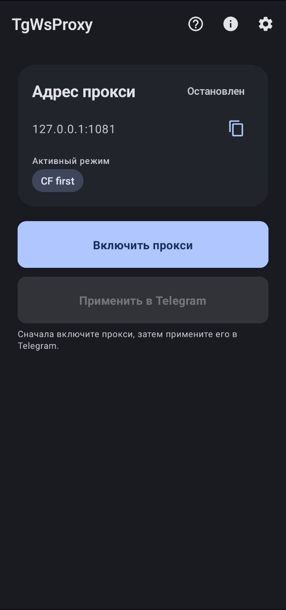
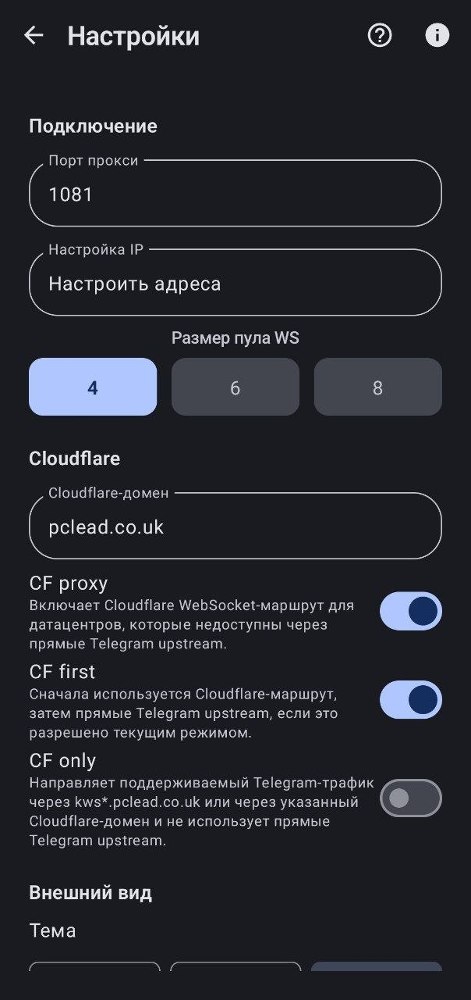

# TgWsProxy Android

Локальный SOCKS5-прокси для Telegram на Android. Приложение поднимает локальный прокси, принимает MTProto-сессии Telegram и перенаправляет поддерживаемый трафик через WebSocket/WSS. Текущая версия умеет выбирать между Direct, Cloudflare Worker и Cloudflare Proxy маршрутами и рассчитана на сети, где прямые Telegram endpoint-ы недоступны или нестабильны.

Текущая версия рабочей ветки: `1.6.0` (production polish: notifications, metrics, onboarding).

Репозиторий: https://github.com/Regstar2/TgWsProxy_Android

## Происхождение

Проект является форком Android-версии `tg-ws-proxy` и сохраняет атрибуцию исходным авторам:

- Runtime-идея и исходный проект: [Flowseal/tg-ws-proxy](https://github.com/Flowseal/tg-ws-proxy)
- Исходный Android-форк: [amurcanov/tg-ws-proxy-android](https://github.com/amurcanov/tg-ws-proxy-android)

Android-форк распространяется под GPLv3. Оригинальный runtime-проект Flowseal распространяется под MIT; соответствующая атрибуция сохранена.

## AI-assisted development

Изменения в этой рабочей ветке подготовлены при помощи Codex и GPT-5.4. Репозиторий остаётся форком и содержит код, идеи и лицензионные обязательства исходных проектов Flowseal и amurcanov; эта пометка не заменяет их атрибуцию.

## Что умеет приложение

- Локальный SOCKS5-прокси на `127.0.0.1`, порт по умолчанию `1081`.
- Быстрое применение прокси в Telegram через deep link.
- Foreground service для фоновой работы.
- Jetpack Compose UI с системной, светлой и тёмной темой.
- Выбор языка интерфейса: системный, русский, английский.
- Настройки Worker domain, CF-domain pool и режимов маршрутизации.
- Runtime-логи в приложении и экспорт логов в выбранную папку.
- Диагностическое логирование стадий `DNS -> TCP -> TLS -> WS`.

## Скриншоты

<p>
  
  
</p>

## Cloudflare Proxy

На мобильной сети текущий рабочий путь подтверждён через CF Proxy и Cloudflare Worker. Direct path до Telegram endpoint-ов на тестовых сетях часто недоступен или нестабилен, поэтому для обычного использования сейчас рекомендуется `Auto`, а при необходимости явного приоритета - `Worker first` или `CF first`.

Режимы:

- `Auto` - адаптивно выбирает маршрут по текущей сети, истории успехов/ошибок, cooldown и last-good route.
- `Direct + fallback routes` - цепочка `Direct -> Worker -> CF -> TCP`.
- `Worker first` - сначала пробует Cloudflare Worker, затем разрешённые fallback-маршруты.
- `CF first` - сначала пробует `kws{dc}.<domain>`, затем fallback-маршруты.
- `CF only` - не использует direct Telegram upstream и direct TCP passthrough для Telegram-like трафика.
- `Worker only` - использует только Worker и тоже не допускает direct TCP passthrough для Telegram-like трафика.
- `Direct only` - только прямой WebSocket route.

Домен по умолчанию: `pclead.co.uk`. Он взят из подхода Flowseal и удобен для проверки, но это общий endpoint. Cloudflare ограничивает одновременные WebSocket-подключения, поэтому домен по умолчанию может временно отдавать `429 Too Many Requests` или перестать работать. Для постоянного использования лучше настроить собственный Cloudflare-домен и указать его в настройках приложения.

Начиная с `v1.3.2`, ручной CF-домен больше не является единственной опорой. Android fork сохраняет поле для пользовательского домена, но также включает встроенный CF-domain pool. Если ручной домен возвращает `429`, `403`, `5xx` или повторно падает на timeout/TLS/WebSocket handshake, runtime временно переводит его в cooldown и пробует другой CF-домен либо следующий маршрут, разрешённый выбранным режимом.

Начиная с `v1.4.0`, приложение также умеет обновлять список CF-доменов из Flowseal upstream GitHub. Обновление не является критической зависимостью: если GitHub недоступен, используется последний кэшированный upstream-список; если кэша ещё нет, остаётся встроенный список. Порядок выбора теперь явный: `Manual -> Cached upstream -> Built-in`. Пустой или битый downloaded list не заменяет сохранённый кэш.

В `v1.5.0` режим **Авто** стал адаптивным: runtime учитывает профиль сети (Wi‑Fi / mobile), статистику успехов/ошибок по маршрутам, cooldown и last-good route, чтобы быстрее выбирать рабочий путь. В `v1.5.1` добавлены пресеты стратегии Auto, явные веса scoring, классификация ошибок, краткие объяснения выбора маршрута и экспорт adaptive diagnostics (в т.ч. markdown-отчёт для GitHub Issues). Ручные режимы остаются предсказуемыми и не зависят от стратегии Auto. Подробнее: [docs/ADAPTIVE_ROUTING.md](docs/ADAPTIVE_ROUTING.md).

В `v1.4.1` обновление upstream-списка стало устойчивее: можно задать HTTPS-зеркало, primary failure автоматически переходит на mirror, ошибки download классифицируются по этапам (DNS/TCP/TLS/HTTP/parse), а автообновление использует backoff (24 часа после успеха, 1 час после ошибки). `Fake TLS` и pinned TLS для GitHub fetch по-прежнему не реализованы.

Для собственного домена используются хосты вида:

```text
kws1.<domain>
kws2.<domain>
kws3.<domain>
kws4.<domain>
kws5.<domain>
kws203.<domain>
```

Ориентируйтесь на инструкцию Flowseal по Cloudflare Proxy: [Flowseal/tg-ws-proxy](https://github.com/Flowseal/tg-ws-proxy).

## Как пользоваться

1. Установите APK.
2. Откройте TgWsProxy.
3. Проверьте порт. По умолчанию используется `1081`.
4. Для большинства пользователей выберите `Auto`. Если Direct часто ломается, попробуйте `Worker first`; если есть проверенный CF domain - `CF first`.
5. Нажмите `Включить прокси`.
6. Нажмите `Применить в Telegram`.
7. Для диагностики временно включите runtime-логи и сохраните отчёт в выбранную папку.

Если используется ByeDPI или другой локальный прокси, порт `1081` обычно удобнее `1080`, чтобы избежать конфликта.

## UI, Help и уведомления (v1.6.0)

- **Onboarding** — при первом запуске; повторно: Настройки → Подсказки → «Показать onboarding снова».
- **Подсказки** — разделы: быстрый старт, Telegram SOCKS5, режимы, Worker, CF, уведомление Android, диагностика.
- **О приложении** — версия, описание, ссылки на [репозиторий](https://github.com/Regstar2/TgWsProxy_Android), Flowseal и amurcanov.
- **Диагностика** — компактные проверки Direct / Worker / CF / «Проверить всё»; экспорт отчёта с маскированием доменов.
- **Runtime logs** — по умолчанию скрыты; «Показать runtime logs» открывает отдельный диалог.
- **Foreground notification** — статус, маршрут, скорость/задержка (опционально), действия Start/Stop/Reconnect/Open. Полностью скрыть уведомление при работающем foreground service нельзя (требование Android); доступны режимы Normal / Compact / Minimal. См. [docs/NOTIFICATIONS.md](docs/NOTIFICATIONS.md).

## Сборка

Требования:

- JDK 17
- Android SDK
- Gradle wrapper из репозитория
- Go toolchain для сборки native runtime

Debug APK:

```powershell
.\gradlew.bat assembleDebug
```

Готовый debug APK Gradle кладёт в:

```text
app/build/outputs/apk/debug/app-debug.apk
```

Локальный helper-скрипт дополнительно копирует APK в `artifacts/apk/debug/`:

```powershell
.\scripts\build-apk.ps1 -Configuration Debug
```

Release-подпись хранится только локально. Keystore не должен попадать в git; credentials передаются через переменные окружения:

```powershell
$env:KEYSTORE_PASSWORD="..."
$env:KEY_PASSWORD="..."
$env:KEY_ALIAS="tgwsproxy"
.\scripts\build-apk.ps1 -Configuration Release
```

Файлы APK, runtime-логи, `.so` и локальные Android build artifacts не должны попадать в git. Это зафиксировано в `.gitignore`.

## Диагностика

Полезные признаки в runtime-логах:

- `cfproxy hostname dial start` - попытка подключиться через системный hostname path.
- `cfproxy connected host=... via=hostname` - Cloudflare WebSocket успешно поднят.
- `bridge first-exit primary ...` - первичная причина закрытия bridge-сессии.
- `bridge secondary ...` - вторичная ошибка после закрытия одной из сторон.
- `stats: ... cf=... up=... down=...` - счётчики активных CF-сессий и трафика.

Если `cfproxy connected` есть, но `down=0.0B`, смотрите `bridge first-exit primary`: чаще всего это означает, что клиент Telegram закрыл локальный SOCKS-сокет до начала полезного обмена.

## Текущий статус

Подтверждено:

- CF hostname-first порядок подключения работает.
- `CF first` теперь реально выполняется до direct WS path.
- В CF-first/CF-only режиме WS pool warmup отключён, чтобы не шуметь direct-попытками.
- `DC1` больше не подменяется на `kws2.*` в direct WS domain mapping.
- Bridge-логирование фиксирует первичную причину закрытия сессии.
- Android routing намеренно отличается от Flowseal desktop: Android сохраняет `Worker first`, `CF first`, `Worker only`, `CF only`, `Auto` и `Direct + fallback routes`.
- `v1.3.2` добавляет built-in CF pool, per-domain health/cooldown, диагностику CF-доменов и ручной сброс cooldown.
- `v1.4.0` добавляет cached upstream list, ручное обновление, автообновление с 24-часовым throttle и fallback `Manual -> Cached upstream -> Built-in`.
- `v1.4.1` добавляет mirror URL, staged download diagnostics, retry/backoff и cache-safe multi-source update.
- `Fake TLS` и GitHub pinned TLS fallback не реализованы; эти улучшения остаются будущей работой (`v1.6.0` research).

Не считается финально закрытым:

- стабильность на всех мобильных операторах;
- долгосрочная надёжность общего домена `pclead.co.uk`;
- workflow для настройки собственного Cloudflare-домена в один клик.

## Документация

- [RELEASE_NOTES_v1.6.0.md](RELEASE_NOTES_v1.6.0.md) - заметки к текущему релизу.
- [ORIGINAL_VS_ANDROID_DIFF.md](ORIGINAL_VS_ANDROID_DIFF.md) - заметки по сравнению с Flowseal runtime и исходным Android-форком.
- [docs/CF_DOMAIN_POOL.md](docs/CF_DOMAIN_POOL.md) - источники CF-доменов, cache policy и fallback order.
- [docs/NOTIFICATIONS.md](docs/NOTIFICATIONS.md) - foreground notification, метрики и действия.
- [docs/RELEASE_CHECKLIST.md](docs/RELEASE_CHECKLIST.md) - чеклист перед релизом.

## Лицензия

См. [LICENSE](LICENSE).
