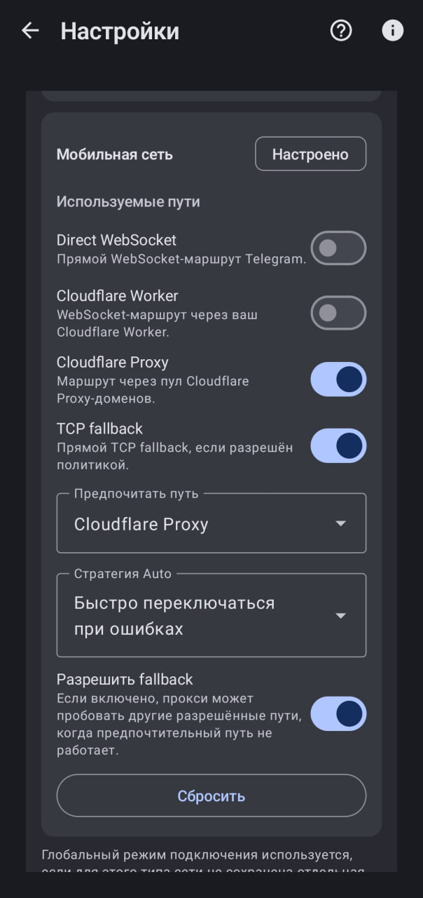
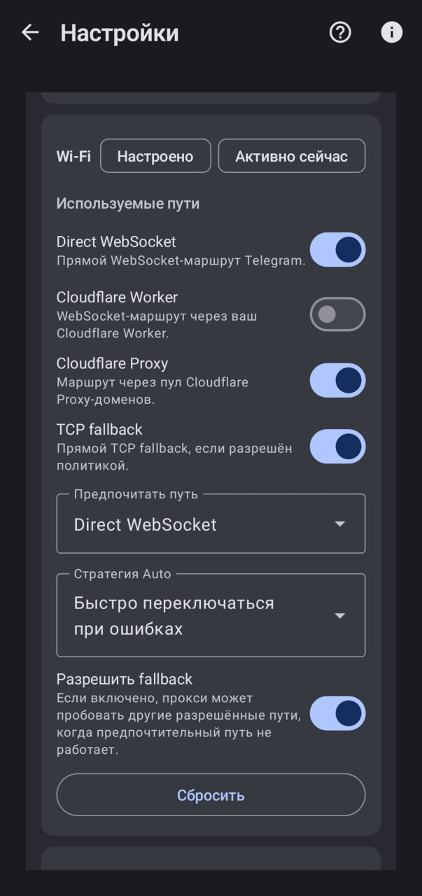

# TGWSProxyAndroid

Android-приложение для локального SOCKS5-прокси Telegram с маршрутизацией через WebSocket (Direct, Cloudflare Worker, Cloudflare Proxy) и TCP fallback. Нативный runtime (`libtgwsproxy.so`) управляется из Kotlin UI.

**Версия:** 1.8.0 · **Статус:** активная разработка  

Репозиторий: https://github.com/Regstar2/TgWsProxy_Android

## Обзор

TgWsProxy поднимает прокси на `127.0.0.1` (порт по умолчанию `1081`), принимает SOCKS5 от Telegram и направляет MTProto-трафик по выбранным маршрутам. Подходит для сетей, где прямые Telegram endpoint-ы недоступны или нестабильны.

**Приложение не является VPN** и не шифрует весь трафик устройства — только сессии, идущие через настроенный SOCKS5 в Telegram.

## Возможности

- Локальный SOCKS5 для Telegram, deep link «Применить в Telegram»
- Foreground service и уведомление со статусом
- Режимы и **политики маршрутов** отдельно для Wi‑Fi и мобильной сети
- Cloudflare Proxy (`cf_proxy_ws`) с пулом доменов и cooldown
- Опциональный Cloudflare Worker (`cf_worker_ws`)
- Прямой WebSocket (`direct_ws`) и TCP fallback
- Адаптивный режим **Auto** (статистика, cooldown, last-good)
- Runtime-логи, экспорт, диагностика маршрутов
- RU/EN интерфейс, светлая/тёмная тема

## Скриншоты

<p align="center">
  
  
  
</p>

## Маршруты

| Тип маршрута | Описание |
|------------|----------|
| `direct_ws` | Прямой WebSocket к Telegram (`kws{dc}.web.telegram.org`) |
| `cf_proxy_ws` | Cloudflare Proxy через `wss://kws{dc}.<domain>/apiws` |
| `cf_worker_ws` | WebSocket через ваш Cloudflare Worker |
| `tcp_fallback` | Резервный TCP к IP датацентра :443 |

**WebSocket — это транспорт**, а не название маршрута. Например, Cloudflare Proxy использует WebSocket, но это не «прямой WebSocket».

В UI отображаются отдельно: **режим (стратегия)**, **текущий маршрут (route kind)** и **транспорт**.

Подробнее: [docs/architecture/architecture.md](docs/architecture/architecture.md)

## Рекомендуемые настройки

Ориентиры без привязки к конкретной сети оператора:

| Сеть | Рекомендация |
|------|----------------|
| **Мобильная** | Предпочитать `cf_proxy_ws`, оставить `tcp_fallback`; direct/worker включать вручную только при необходимости |
| **Wi‑Fi** | Часто подходит `direct_ws` с fallback на CF proxy и TCP |

В приложении: **Настройки → политика маршрутов** для Wi‑Fi/Mobile или пресет **«Рекомендуемый»** (если политика не менялась вручную — см. миграцию в release notes).

Режимы legacy (Auto, CF first, Worker first, …) по-прежнему передаются в runtime; фактический набор маршрутов задаёт политика `@route_*`.

## Быстрый старт

1. Установите APK (debug или release).
2. Откройте TgWsProxy, проверьте порт (`1081` по умолчанию).
3. Настройте политику маршрутов для вашей сети.
4. **Включить прокси** → **Применить в Telegram**.
5. При проблемах включите runtime-логи и сохраните отчёт.

Если параллельно используется ByeDPI на `1080`, выберите другой порт (например `1081`).

## Логи и диагностика

Logcat, тег **`TgWsProxy`**. Полезные строки:

| Строка | Значение |
|--------|----------|
| `route_policy network=... routes=... preferred=...` | Активная политика |
| `Policy changed generation=...` | Смена поколения policy |
| `Route selected routeKind=... transport=...` | Выбор маршрута |
| `cfproxy connected host=...` | Успешный CF proxy |
| `UI route state activeRouteKind=... transport=...` | Состояние для UI |
| `Skip current stats update route=... reason=...` | Старое/отключённое событие не влияет на UI |

В приложении: runtime logs, экспорт, карточка политики маршрутов, проверки Direct/Worker/CF/TCP.

## Структура репозитория

| Путь | Содержимое |
|------|------------|
| `app/` | Android-приложение (Kotlin, UI, сервис) |
| `native/tgwsproxy/` | Нативный proxy runtime (Go → `libtgwsproxy.so`) |
| `docs/` | Документация, скриншоты в `docs/assets/screenshots/` |
| `scripts/` | Сборка native/APK, иконки |

Подробнее: [docs/development/repository-structure.md](docs/development/repository-structure.md)

## Сборка

**Требования:** JDK 17, Android SDK, Go (для `native/tgwsproxy`), Gradle wrapper из репозитория.

Debug:

```powershell
.\gradlew.bat assembleDebug
```

APK: `app\build\outputs\apk\debug\app-debug.apk`

Скрипт с копированием в `artifacts/`:

```powershell
.\scripts\build-apk.ps1 -Configuration Debug
```

Release (локальная подпись, секреты только в env):

```powershell
$env:KEYSTORE_FILE = "tgwsproxy-release.jks"
$env:KEYSTORE_PASSWORD = "..."
$env:KEY_PASSWORD = "..."
$env:KEY_ALIAS = "tgwsproxy"
.\scripts\build-apk.ps1 -Configuration Release
```

Go-тесты (из каталога runtime):

```powershell
cd native\tgwsproxy
go test ./...
```

Подробнее: [docs/releases/release.md](docs/releases/release.md)

## Документация

| Документ | Описание |
|----------|----------|
| [docs/development/repository-structure.md](docs/development/repository-structure.md) | Структура репозитория |
| [docs/architecture/architecture.md](docs/architecture/architecture.md) | Архитектура и терминология |
| [docs/testing/README.md](docs/testing/README.md) | Чеклист ручного тестирования |
| [docs/testing/manual-checklist-1.8.md](docs/testing/manual-checklist-1.8.md) | Проверка после рефакторинга 1.8 |
| [docs/releases/release.md](docs/releases/release.md) | Выпуск релиза и APK |
| [CHANGELOG.md](CHANGELOG.md) | История версий |
| [docs/architecture/ADAPTIVE_ROUTING.md](docs/architecture/ADAPTIVE_ROUTING.md) | Адаптивный режим Auto |
| [docs/architecture/CONNECTION_MODES.md](docs/architecture/CONNECTION_MODES.md) | Режимы подключения |
| [docs/releases/](docs/releases/) | Заметки и чеклисты релизов |

## Разработка с помощью нейросетей

Значительная часть кода, документации и рефакторингов в этом репозитории выполнялась **с использованием больших языковых моделей** (в том числе через Cursor, OpenAI Codex, ChatGPT и аналогичные инструменты). Нейросети применялись для:

- проектирования и правок Kotlin UI, настроек маршрутов и сервиса;
- доработки native runtime, bridge и маршрутизации;
- написания и обновления README и документации в `docs/`;
- разбора логов, диагностики багов и подготовки release notes.

## Происхождение

- **[Flowseal/tg-ws-proxy](https://github.com/Flowseal/tg-ws-proxy)** — исходный прокси и маршруты (MIT)
- **[amurcanov/tg-ws-proxy-android](https://github.com/amurcanov/tg-ws-proxy-android)** — Android-обёртка (GPLv3)
- **[Regstar2/TgWsProxy_Android](https://github.com/Regstar2/TgWsProxy_Android)** — текущая разработка ([LICENSE](LICENSE))

Схема `kws{dc}.<domain>/apiws` и домен по умолчанию — из экосистемы Flowseal. Отличия от desktop: [ORIGINAL_VS_ANDROID_DIFF.md](ORIGINAL_VS_ANDROID_DIFF.md).

## Лицензия

[LICENSE](LICENSE) (GPLv3).
