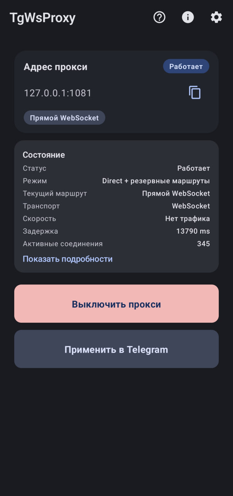
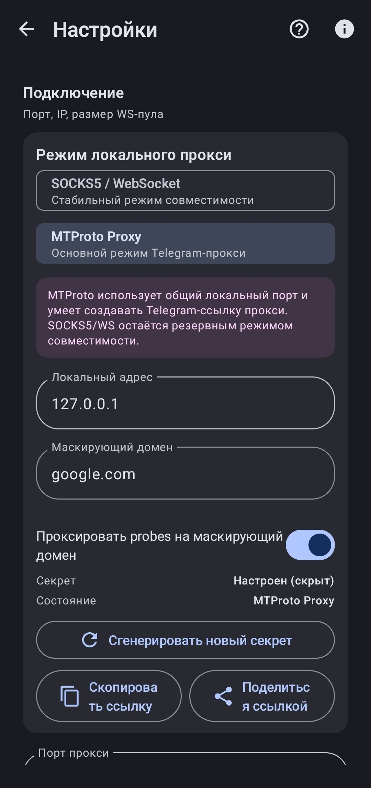
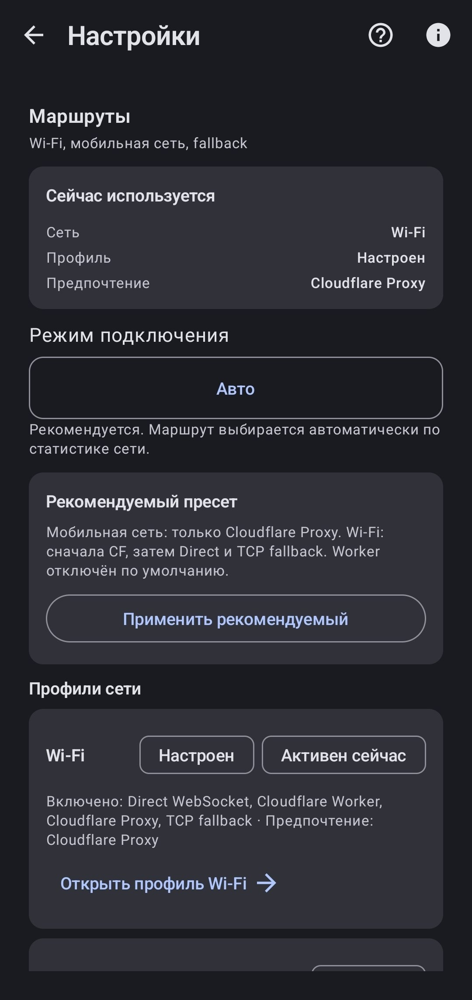
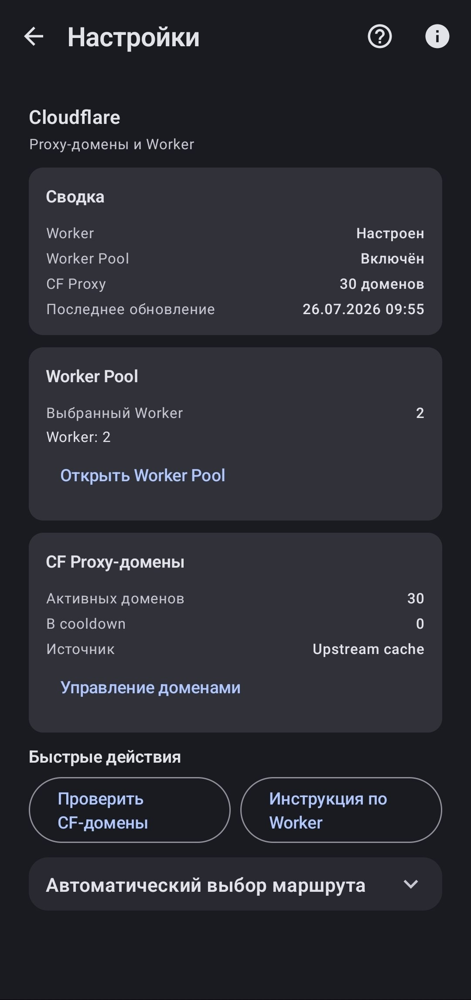
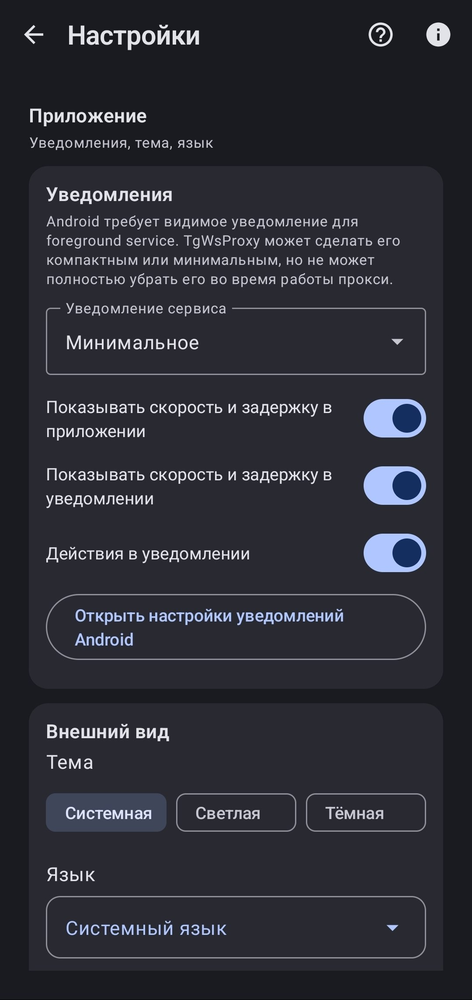
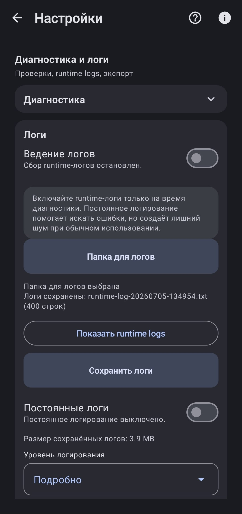

<div align="center">


# TgWsProxy Android

Локальный прокси для Telegram на Android с MTProto- и SOCKS5-frontend и маршрутизацией через Cloudflare Proxy, прямой WebSocket, Cloudflare Worker или TCP.

**Русский** · [English](README_EN.md)

[](CHANGELOG.md)
[](app/build.gradle.kts)
[](app/build.gradle.kts)
[](#документация)
[](LICENSE)

[Быстрый старт](#быстрый-старт) ·
[Документация](#документация) ·
[Релизы](https://github.com/Regstar2/tg-ws-proxy-android/releases) ·
[Сообщить об ошибке](https://github.com/Regstar2/tg-ws-proxy-android/issues)

</div>

---

## О проекте

TgWsProxy запускает локальный прокси на Android-устройстве. Telegram подключается к нему через MTProto Proxy или совместимый SOCKS5-режим, после чего нативный runtime выбирает разрешённый маршрут к инфраструктуре Telegram.

Основной сценарий версии `1.10.13` — **MTProto Proxy → Cloudflare Proxy** на локальном адресе `127.0.0.1:1443`. Приложение не создаёт системный VPN-туннель и не перенаправляет весь трафик устройства.

## Статус проекта

**Версия исходников:** `1.10.13` (`versionCode 51`)  
**Стадия:** release candidate; тег и GitHub Release публикуются только после финального аудита #7

| Область | Статус |
|---|---|
| MTProto Proxy через `cf_proxy_ws` | Основной сценарий; ранее вручную проверен на мобильной сети и Wi-Fi |
| SOCKS5 / WebSocket frontend | Реализован как режим совместимости |
| `direct_ws` и `tcp_fallback` | Реализованы; доступность зависит от сети |
| Cloudflare Worker | Реализован как необязательный маршрут |
| Worker Pool | Реализован, но остаётся медленным и не рекомендуется как основной маршрут |
| Feedback | Отдельный экран; GitHub Issue Forms без встроенного PAT |
| Updates | Проверка официальных GitHub Releases с SemVer и открытием официальной страницы релиза |

## Возможности

- локальный MTProto Proxy с генерацией ссылок `t.me/proxy` и `tg://proxy`;
- совместимый SOCKS5 frontend на том же настраиваемом порту;
- маршруты `cf_proxy_ws`, `direct_ws`, `cf_worker_ws` и `tcp_fallback`;
- отдельные политики маршрутов для Wi-Fi, мобильной и неизвестной сети;
- Fake TLS secrets формата `dd<secret>` и `ee<secret><domain_hex>`;
- необязательный passthrough probe-соединений на указанный masking domain;
- foreground service, уведомление о состоянии и watchdog локального listener;
- диагностика маршрутов, runtime status, экспорт отчёта и настраиваемое логирование;
- отдельные экраны обратной связи и проверки обновлений;
- русский и английский интерфейс.

## Скриншоты

<p align="center">
  
  
  
  
  <br>
  
  
  
</p>

## Быстрый старт

1. Установите ARM64 APK из [GitHub Releases](https://github.com/Regstar2/tg-ws-proxy-android/releases), если нужная версия опубликована, либо [соберите debug APK](#сборка).
2. Откройте TgWsProxy.
3. Оставьте frontend **MTProto Proxy** и порт `1443`, если он не занят другим локальным сервисом.
4. Нажмите **Включить прокси**.
5. Нажмите **Применить в Telegram** и подтвердите конфигурацию в Telegram.

Если Telegram не подключается, откройте встроенную диагностику и отдельно проверьте маршрут `cf_proxy_ws`.

## Требования

### Для использования

- Android 8.0 или новее (`minSdk 26`);
- устройство с ABI `arm64-v8a`;
- установленный Telegram;
- сеть, в которой доступен хотя бы один разрешённый маршрут.

### Для сборки

- Windows и PowerShell;
- JDK 17;
- Android SDK и Android NDK;
- Go;
- Python 3;
- Gradle Wrapper из репозитория.

Текущий native build script использует Windows-путь к NDK toolchain. Сборка на Linux и macOS репозиторием не заявлена.

## Установка

Проверьте [GitHub Releases](https://github.com/Regstar2/tg-ws-proxy-android/releases) на наличие APK нужной версии. Локально собранный debug APK устанавливается через ADB:

```powershell
adb install -r app\build\outputs\apk\debug\app-debug.apk
```

При переходе между debug- и release-подписями Android может потребовать удалить ранее установленное приложение. Перед удалением приложения учитывайте, что его локальные настройки могут быть потеряны.

## Использование

### MTProto Proxy

1. Выберите frontend **MTProto Proxy**.
2. Проверьте локальный адрес и порт.
3. При необходимости укажите masking domain.
4. Запустите сервис и примените конфигурацию в Telegram.

Без masking domain ссылка использует secret вида `dd<32 hex chars>`. При указанном домене используется формат `ee<secret><domain_hex>`.

### SOCKS5-режим совместимости

Настройте Telegram вручную:

```text
Host: 127.0.0.1
Port: 1443
Username: пусто
Password: пусто
```

Если порт изменён в приложении, укажите то же значение в Telegram.

## Режимы работы

### Локальные frontend-ы

| Frontend | Назначение | Ограничение |
|---|---|---|
| MTProto Proxy | Основной режим с применением через MTProto proxy link | Использует только локальный порт приложения |
| SOCKS5 / WebSocket | Совместимость с ручной SOCKS5-конфигурацией Telegram | Требует ручного ввода адреса и порта |

### Маршруты

| Route kind | Назначение | Ограничение |
|---|---|---|
| `cf_proxy_ws` | WebSocket через Cloudflare Proxy domains: `kws{dc}.<domain>/apiws` | Доступность зависит от внешних доменов и сети |
| `direct_ws` | Прямой WebSocket к `kws{dc}.web.telegram.org` | Может блокироваться или работать нестабильно |
| `cf_worker_ws` | WebSocket через Cloudflare Worker пользователя | Требует отдельной настройки Worker |
| `tcp_fallback` | Прямой TCP к IP датацентра Telegram на порту `443` | Не является WebSocket-маршрутом |

WebSocket — транспорт. Фактический путь в интерфейсе и диагностике обозначается отдельным `route kind`.

## Конфигурация

Значения по умолчанию для версии `1.10.13`:

| Параметр | Значение |
|---|---|
| Локальный адрес | `127.0.0.1` |
| Локальный порт | `1443` |
| Frontend | MTProto Proxy |
| Мобильная сеть | только `cf_proxy_ws`, без fallback |
| Wi-Fi | `cf_proxy_ws` → `direct_ws` → `tcp_fallback` |
| Неизвестная сеть | только `cf_proxy_ws`, без fallback |
| Runtime-сбор логов | выключен |
| Persistent file logs | выключены |

Миграция значений по умолчанию применяется только к пользователям, которые не меняли политики маршрутов вручную.

> [!WARNING]
> Включайте masking-domain passthrough только для доверенного домена. Приложение будет устанавливать реальные исходящие соединения с указанным хостом.

## Архитектура

```text
Telegram
   │
   ▼
локальный MTProto Proxy или SOCKS5 frontend
   │
   ▼
Android ProxyService (foreground service)
   │
   ▼
Go runtime: libtgwsproxy.so
   │
   ├── cf_proxy_ws
   ├── direct_ws
   ├── cf_worker_ws
   └── tcp_fallback
```

Android-часть написана на Kotlin и Jetpack Compose. Нативный runtime расположен в `native/tgwsproxy/`, собирается как `libtgwsproxy.so` и подключается к Android-приложению через JNA/CGO bridge.

Подробное описание: [docs/architecture/architecture.md](docs/architecture/architecture.md).

## Безопасность

- MTProto secret, query-параметры и чувствительные адреса маскируются в интерфейсе, диагностических отчётах и логах там, где это предусмотрено реализацией.
- URL Cloudflare Worker, proxy secrets, keystore и переменные подписи нельзя публиковать в issue, логах или коммитах.
- Release signing использует локальные переменные окружения; keystore исключён из Git.
- Feedback не прикладывает runtime-логи, proxy credentials, Telegram data, IP-адреса или секреты автоматически.
- Проверка обновлений использует официальный GitHub Releases API; установка APK приложением не выполняется.
- Masking domain меняет форму Fake TLS handshake, но не превращает приложение в VPN.

Перед публикацией диагностического отчёта проверьте его вручную.

## Приватность

TgWsProxy обрабатывает соединения, которые Telegram направляет в локальный proxy frontend. Приложение не создаёт системный VPN-туннель и не перехватывает трафик остальных приложений.

В зависимости от политики трафик идёт напрямую к Telegram, через Cloudflare Proxy или через Cloudflare Worker, настроенный пользователем. Runtime-сбор и постоянное сохранение логов выключены по умолчанию и включаются вручную для диагностики.

## Диагностика

Встроенная диагностика показывает:

- настроенный, выбранный и фактически активный маршрут;
- результаты DNS, TCP, TLS, HTTP и WebSocket probe-шагов;
- состояние Cloudflare Proxy и Worker;
- статистику Fake TLS;
- последние ошибки и причины fallback;
- экспортируемый диагностический отчёт.

Runtime использует тег `TgWsProxy` в logcat. Диагностические проверки не должны менять активную политику маршрутов.

## Сборка

Текущий стек:

| Компонент | Версия или значение |
|---|---|
| Android Gradle Plugin | `8.2.2` |
| Gradle Wrapper | `8.2.1` |
| Kotlin | `1.9.22` |
| compileSdk / targetSdk | `35` / `35` |
| minSdk | `26` |
| ABI | `arm64-v8a` |

Сборка debug APK:

```powershell
.\gradlew.bat assembleDebug
```

Gradle вызывает native build и генерацию иконок через `preBuild`. Результат:

```text
app\build\outputs\apk\debug\app-debug.apk
```

Сборка с копированием APK в локальный каталог `artifacts/`:

```powershell
.\scripts\build-apk.ps1 -Configuration Debug
```

Финальная signed release-сборка выполняется только при локально настроенном keystore:

```powershell
.\scripts\release.ps1 -Version v1.10.13
```

Скрипт проверяет соответствие тега `versionName`, подпись APK и формирует APK + SHA-256 в `dist/`.

Отдельная сборка Go runtime:

```powershell
.\scripts\build-native-android.ps1
```

## Тестирование

Единая проектная проверка:

```powershell
.\scripts\ci.ps1
```

Она включает Go module verification, native Go tests, Android unit tests, debug APK build и packaged-resource audit. Финальный release audit дополнительно запускается из CI для release-candidate source.

Ручная проверка перед тегом должна включать запуск и остановку proxy service, подключение Telegram, сообщения и медиа, Wi-Fi ↔ mobile, reconnect, Feedback/Updates и просмотр экспортируемого отчёта на наличие секретов.

Актуальный чек-лист: [docs/testing/README.md](docs/testing/README.md).

## Документация

| Задача | Документ |
|---|---|
| Архитектура и поток данных | [docs/architecture/architecture.md](docs/architecture/architecture.md) |
| Пул Cloudflare Proxy domains | [docs/architecture/CF_DOMAIN_POOL.md](docs/architecture/CF_DOMAIN_POOL.md) |
| Настройка Cloudflare Worker | [docs/architecture/cloudflare-worker.md](docs/architecture/cloudflare-worker.md) |
| Структура репозитория | [docs/development/repository-structure.md](docs/development/repository-structure.md) |
| Ручное тестирование | [docs/testing/README.md](docs/testing/README.md) |
| Подготовка релиза | [docs/releases/release.md](docs/releases/release.md) |
| Release notes `1.10.13` | [docs/releases/RELEASE_NOTES_v1.10.13.md](docs/releases/RELEASE_NOTES_v1.10.13.md) |
| Финальный аудит `1.10.13` | [docs/releases/v1.10.13-final-audit.md](docs/releases/v1.10.13-final-audit.md) |
| История изменений | [CHANGELOG.md](CHANGELOG.md) |

## Происхождение и благодарности

- [Flowseal/tg-ws-proxy](https://github.com/Flowseal/tg-ws-proxy) — upstream runtime и основная идея WebSocket-маршрутизации;
- [amurcanov/tg-ws-proxy-android](https://github.com/amurcanov/tg-ws-proxy-android) — Android-обёртка, от которой началась эта ветка;
- [Regstar2/tg-ws-proxy-android](https://github.com/Regstar2/tg-ws-proxy-android) — текущая Android-реализация и дальнейшая разработка.

При разработке отдельных участков кода, тестов и документации использовались AI-инструменты. Итоговые изменения проверяются тестами и release-аудитом; ручная device acceptance остаётся обязательным финальным шагом.

## Ограничения

- поддерживается только ABI `arm64-v8a`;
- приложение является прокси для Telegram, а не системным VPN;
- доступность маршрутов зависит от сети и внешней инфраструктуры;
- Worker Pool остаётся медленным и не предназначен для основного сценария;
- порт `1443` нужно изменить, если его уже использует другой локальный сервис;
- native build script ориентирован на Windows; поддержка Linux и macOS не подтверждена;
- masking-domain passthrough создаёт соединения с указанным доменом;
- наличие APK для каждой версии в GitHub Releases не гарантируется.

## Лицензия

Проект распространяется по лицензии [GNU General Public License v3.0](LICENSE).
